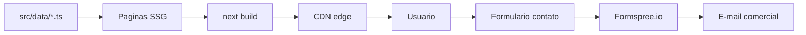

# Arquitetura - RBR-SITE

Visao tecnica do site institucional da RoboticsBr.

## Stack

- **Framework**: Next.js 15 com App Router
- **Linguagem**: TypeScript 5.8 (strict)
- **UI**: React 19
- **Estilos**: Tailwind CSS 4 (PostCSS) + tema customizado em `src/app/globals.css`
- **Tipografia**: Inter via `next/font/google`
- **Icones**: lucide-react
- **Deploy**: Vercel (CDN edge + ISR)
- **Analytics**: Vercel Analytics + Speed Insights + GA4 (sob consentimento)

## Renderizacao

Quase todas as paginas sao **estaticas (SSG)**:

- Home, Sobre, Equipe, Contato, Servicos, Blog, Cases sao geradas em build.
- Rotas dinamicas (`/cases/[slug]`, `/blog/[slug]`) usam `generateStaticParams` para SSG.
- Apenas componentes interativos (Navbar, FAQ, formulario, carrosseis, banners) carregam JavaScript no cliente via `'use client'`.

## Estrutura de pastas

```
src/
  app/
    layout.tsx           # Root layout com metadata, fonts, Navbar/Footer
    page.tsx             # Home
    globals.css          # Tema Tailwind + reduced-motion + z-index
    sitemap.ts           # Sitemap dinamico
    robots.ts            # robots.txt
    opengraph-image.tsx  # OG image programatica (1200x630)
    manifest.ts          # PWA manifest
    {sobre,equipe,contato,blog,cases,servicos,...}/
  components/            # Componentes reutilizaveis
  data/                  # Conteudo estatico (cases, posts)
  hooks/                 # Custom hooks (useScrollAnimation)
  lib/                   # Utilitarios (markdown, constants)
public/
  images/                # Logos, portfolio, og
  team/                  # Fotos da equipe
docs/                    # Esta documentacao
```

## Fluxo de conteudo



## SEO

- Metadata por rota com `export const metadata`.
- JSON-LD: `Organization`, `LocalBusiness` no layout; `BlogPosting`, `Article`, `FAQPage` por pagina.
- Sitemap dinamico em `/sitemap.xml`.
- Robots em `/robots.txt`.
- OG image programatica via `app/opengraph-image.tsx`.
- Canonical URLs explicitas em metadata.

## Performance

- Imagens via `next/image` com formats AVIF/WebP.
- Inter via `next/font` (auto self-hosted, zero CLS).
- `experimental.optimizePackageImports` para tree-shake do `lucide-react`.
- Scroll handlers com `requestAnimationFrame`.
- Carrosseis pausam em aba inativa (visibilitychange) e em `prefers-reduced-motion`.

## Acessibilidade

- Skip link no layout.
- Navbar mobile com `aria-expanded`, focus trap e Esc.
- Carrosseis com botao de pausa (`aria-pressed`) e `aria-live` no slide ativo.
- Cards do TeamCarousel acessiveis por teclado (`role="button"`, Enter/Space).
- `prefers-reduced-motion` desativa animacoes globalmente.

## Privacidade

- Banner de consentimento com Google Consent Mode v2.
- GA4 carrega apenas apos `analytics_storage: granted`.
- Paginas legais: `/politica-de-privacidade`, `/termos-de-uso`.

## Variaveis de ambiente

Vide `.env.example` e `src/lib/constants.ts`.

## Governanca de conteudo

Cases e posts vivem em `src/data/{cases,blog}.ts` como arquivos TypeScript tipados.
Para 6 cases e 3 posts atuais, este formato e suficiente e oferece type-safety
direto no editor.

Quando o volume passar de ~20 itens ou for necessario que pessoas nao-tecnicas
editem conteudo, considere migrar para:

1. **Markdown + frontmatter** com `gray-matter` + MDX (mantem o repositorio como
   fonte da verdade).
2. **CMS headless** (Sanity, Payload, Contentful) - mais fluxo editorial, mais
   custo de infra.

Os tipos ja contem `updatedAt` (cases obrigatorio, blog opcional) e
`imageAlt`/`coverAlt` para texto alternativo. O sitemap usa `updatedAt` real
em ambos.

## Headers de seguranca

Configurados em `vercel.json`:

- `Content-Security-Policy`, `Strict-Transport-Security`, `X-Frame-Options`,
- `X-Content-Type-Options`, `Referrer-Policy`, `Permissions-Policy`,
- `Cross-Origin-Opener-Policy`, `X-DNS-Prefetch-Control`.
